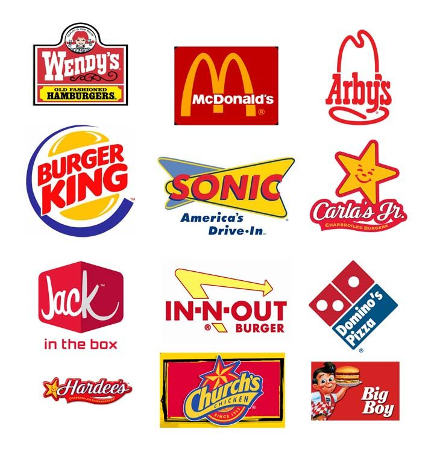
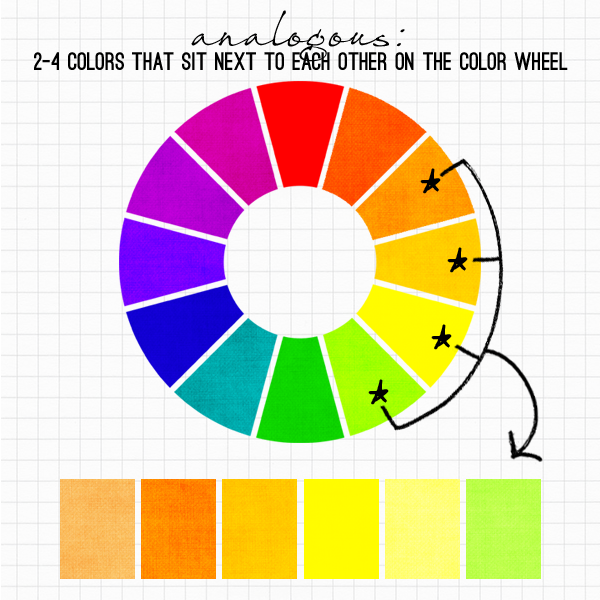
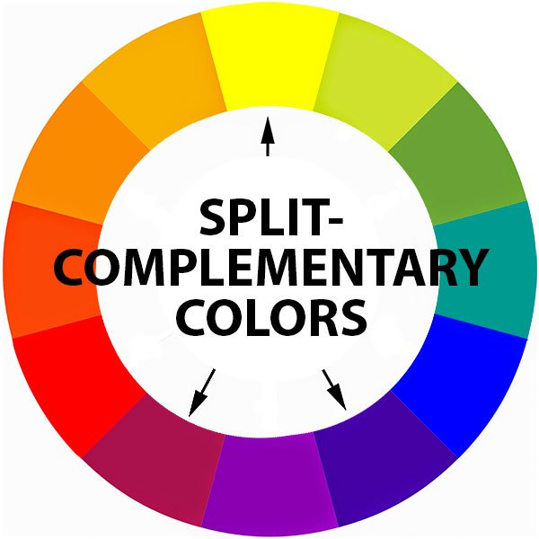
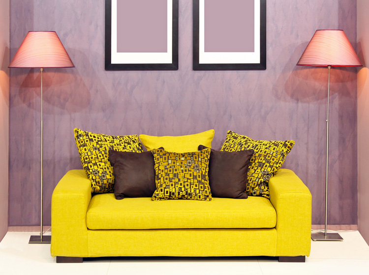
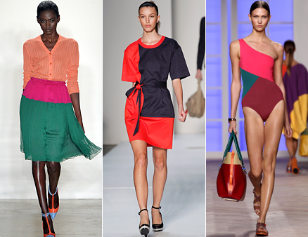

## Familiar color combinations

National flags, standard business clothing, holiday themes, global brands and products, tacky interiors of marble and gilding...

<div style='text-align: left;'>
    
    
    
    
    
</div>

<br /><br />
We've seen all of these color combinations a million times before.

We don't notice them any more.

---

## Analogous split-complementary colors

To select combinations of colors, we can:

- Rely on the tried-and-true formulas (but they are kind of boring), 
- Pick random colors (but they probably won't look so good),
- Use the analogous split complementary color scheme that artists use.

<div style='text-align: left; vertical-align: text-center;'>
    <table>
    <tr>
    <td>
    
    </td>
    <td>
    
    </td>
    <td>
    
    </td>
    </tr>
    <tr>
    <td>Analogous colors (yellow)</td>
    <td>+ Split Complementary colors (magenta and blue-violet)</td>
    <td>= Exciting and harmonious color palette</td>
    </tr>
    </table>
</div>

---

## How do we find the complement of a color in R?

Using the colourpicker widget from the colourpicker package, we select a color and get its value in hexadecimal. For example, #F21FD6 is a very bright pink, which I render in an R plot below, along with its calculated complement.
```{r fig1, fig.height = 3, fig.width = 4, fig.align = "center", echo=FALSE}

    # Function to convert hue to RGB, which we need to define in knitr BEFORE we use it.
hue_2_rgb <- function(v1, v2, vhue) {
  if (vhue < 0)
  {
    vhue <- vhue + 1
  }
  
  if (vhue > 1)
  {
    vhue <- vhue - 1
  }
  
  if ((6 * vhue) < 1)
  {
    v1 + (v2 - v1) * 6 * vhue
  }
  else if ((2 * vhue) < 1)
  {
    v2
  }
  else if ((3 * vhue) < 2)
  {
    v1 + (v2 - v1) * ((2 / 3 - vhue) * 6)
  }
  else
  {
    v1
  }
}

     # We need to split out the RGB color into its red, green, and blue components. 
      allColor <- "#F21FD6"
      rcolorHex <- substr(allColor, 2, 3)
      gcolorHex <- substr(allColor, 4, 5)
      bcolorHex <- substr(allColor, 6, 7)
      
      # The RGB colors are in hexadecimal, so we will need to convert the values from hex into decimal.
      rcolor <- strtoi(rcolorHex, 16)
      gcolor <- strtoi(gcolorHex, 16)
      bcolor <- strtoi(bcolorHex, 16)
      
      # Let's set a seed for how the other colors are generated
      set.seed(rcolor)
      
      # Let's normalize the values to 255, which is the maximum value for each color component
      rcolorNorm <- rcolor/255
      gcolorNorm <- gcolor/255 
      bcolorNorm <- bcolor/255
      
      # I am adapting the RGB to HSL conversion code from what I found written in PHP at serennu.com,
      # http://serennu.com/colour/rgbtohsl.php
      
      # which.min returns the index of the minimum value, not the actual minimum value
      rgb_vector <- c(rcolorNorm, gcolorNorm, bcolorNorm)
      var_min <- which.min(rgb_vector)
      value_min <- rgb_vector[var_min]
      var_max <- which.max(rgb_vector)
      value_max <- rgb_vector[var_max]
      # delta_max is the total range between max and min values
      delta_max <- value_max - value_min
      
      # And it looks like l, for lightness, is the midpoint between the max and the min values
      lightness <- (value_max + value_min) / 2
      
        if (lightness < 0.5) { saturation <- delta_max / (value_max + value_min) } else {
          saturation <- delta_max / (2 - value_max - value_min)
        };
        
        # I am adapting the RGB to HSL conversion code from what I found written in PHP at serennu.com,
        # http://serennu.com/colour/rgbtohsl.php.
        
        delta_r <- (((value_max - rcolorNorm) / 6) + (delta_max / 2)) / delta_max
        delta_g <- (((value_max - gcolorNorm) / 6) + (delta_max / 2)) / delta_max
        delta_b <- (((value_max - bcolorNorm) / 6) + (delta_max / 2)) / delta_max
        
        if (rcolorNorm == value_max) { hue <- delta_b - delta_g } else if (gcolorNorm == value_max) { hue <- (1 / 3) + delta_r - delta_b } else if (bcolorNorm  == value_max) { hue <- (2 / 3) + delta_g - delta_r }
        
                # The hue gets mapped to a square that goes from 0 to 1 in both dimensions, so if the
        # adjusted value falls outside of this box, map it back into the box.
        if (hue < 0)
        {
          hue <- hue + 1
        }
        
        if (hue > 1)
        {
          hue <- hue - 1
        }
      
      # The exact complement is just 0.5 off from our input hue
      hueComplement <- hue + 0.5
      if (hueComplement > 1)
      {
        hueComplement <- hueComplement - 1
      }
      
         if (lightness < 0.5) { var2 <- lightness * (1 + saturation) } else { var2 <- (lightness + saturation) - (saturation * lightness) }
    
    var1 <- 2 * lightness - var2;
    r <- 255 * hue_2_rgb(var1,var2,hueComplement + (1 / 3))
    g <- 255 * hue_2_rgb(var1,var2,hueComplement)
    b <- 255 * hue_2_rgb(var1,var2,hueComplement - (1 / 3))
    
   rgbComplement <- rgb(round(r), round(g), round(b), maxColorValue=255)


      yy<-c(0,0,1,1)
      xx<-c(0,1,1,0)
      xxAll <- c(0,3,3,0)
      plot(xxAll, yy, axes=FALSE, ann=FALSE, type='n')
      polygon(xx, yy, col="#F21FD6", border="#F21FD6")
      
      xx2<-c(0,1,1,0) + 2
      polygon(xx2, yy, col=rgbComplement, border=rgbComplement)
      
           # We also write a list of the RGB colors that we actually generated here.
      mtext(paste("Color: ", "#F21FD6", " Complement: ", rgbComplement),side=1,line=1)

```

- We find the complement for #F21FD6 by converting it from the RGB (for red-green-blue) color scheme used on computer monitors into an HSL (for hue-saturation-lightness) scheme, which maps the hue to the range 0 <= hue < 1. 
- Then we get the complementary hue, `r rgbComplement`, by adding 0.5 to the value of the starting hue and converting back to RGB color. Look at the index.Rmd source file to see!

---

## The split complement and analogous colors in R

- If the complement of a hue is the hue + 0.5, then the split complement is offset from the complement by 0.08333 (1/12), so that is calculated as hue +/- 0.41667.
- Analogous colors form 1/3 of the color wheel that is adjacent to the selected color. So, to calculate those, I choose a hue from within a range of hue +/- 0.16667.
- I mix up the saturation a bit, for some variety, and limit the lightness to a fixed band so that we don't generate too many black or white swatches.
- Then I convert back to RGB colors, and plot out four color swatches: the original color, one split complement, and two analogous colors. Discover a new color combination!

<div style='vertical-align: text-top;'>
    
    
    
    
</div>