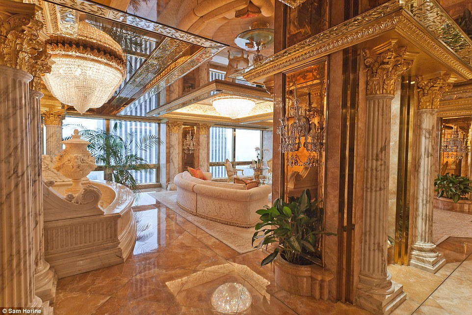
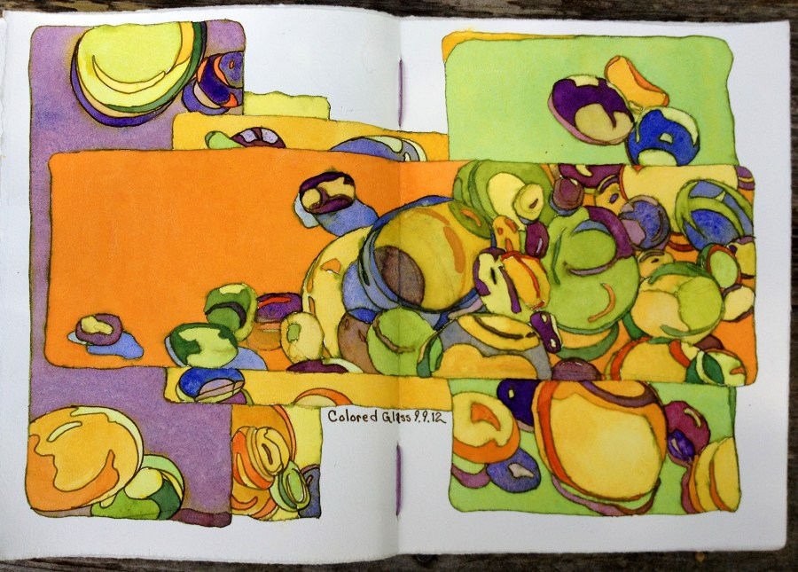
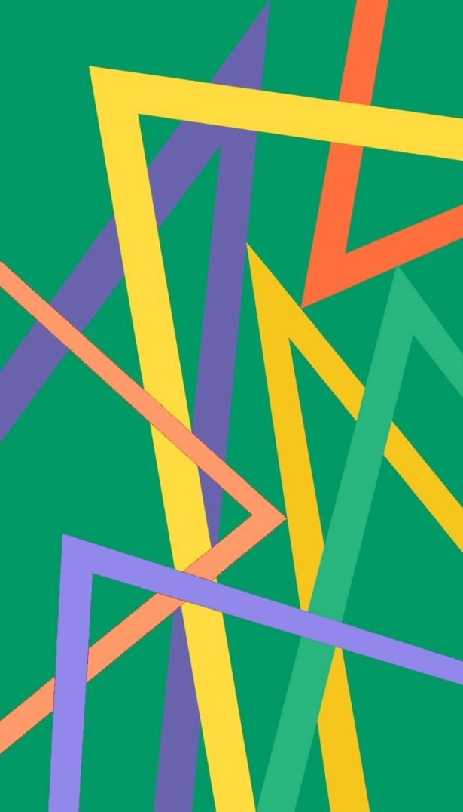

## Familiar color combinations

National flags, standard business clothing, holiday themes, global brands and products, tacky interiors of marble and gilding...

    
    
    
    
    

  
We've seen all of these color combinations a million times before.

We don't notice them any more.

---

## Analogous split-complementary colors

To select combinations of colors, we can:

- Rely on the tried-and-true formulas (but they are kind of boring), 
- Pick random colors (but they probably won't look so good),
- Use the analogous split complementary color scheme that artists use.

    <table>
    <tr>
    <td>
    
    </td>
    <td>
    
    </td>
    <td>
    
    </td>
    </tr>
    <tr>
    <td>Analogous colors (yellow)</td>
    <td>+ Split Complementary colors (magenta and blue-violet)</td>
    <td>= Exciting and harmonious color palette</td>
    </tr>
    </table>

---

## How do we find the complement of a color in R?

Using the colourpicker widget from the colourpicker package, we select a color and get its value in hexadecimal. For example, #F21FD6 is a very bright pink, which I render in an R plot below, along with its calculated complement.

- We find the complement for #F21FD6 by converting it from the RGB (for red-green-blue) color scheme used on computer monitors into an HSL (for hue-saturation-lightness) scheme, which maps the hue to the range 0 <= hue < 1. 
- Then we get the complementary hue, #1FF23B, by adding 0.5 to the value of the starting hue and converting back to RGB color. Look at the index.Rmd source file to see!

---

## The split complement and analogous colors in R

- If the complement of a hue is the hue + 0.5, then the split complement is offset from the complement by 0.08333 (1/12), so that is calculated as hue +/- 0.41667.
- Analogous colors form 1/3 of the color wheel that is adjacent to the selected color. So, to calculate those, I choose a hue from within a range of hue +/- 0.16667.
- I mix up the saturation a bit, for some variety, and limit the lightness to a fixed band so that we don't generate too many black or white swatches.
- Then I convert back to RGB colors, and plot out four color swatches: the original color, one split complement, and two analogous colors. Discover a new color combination!

    
    
    
    

